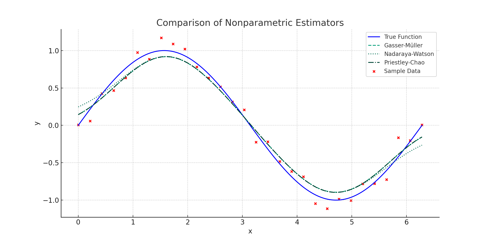
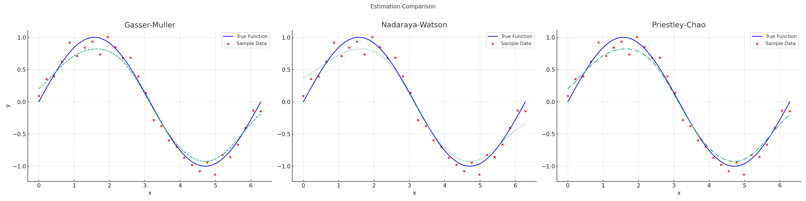

# Nonparametric Regression Library: Kernel-based Estimators

## Overview

This Nonparametric Regression Library is inspired by the [Kernel Regression methods](https://en.wikipedia.org/wiki/Kernel_regression) and offers a collection of nonparametric estimators for regression tasks. It includes implementations of the Gasser-Müller, Nadaraya-Watson, and Priestley-Chao estimators.

### Key Features

- **Gasser-Müller Estimator**: Utilizes local averaging and Gaussian kernel for smoothing.
- **Nadaraya-Watson Estimator**: Employs a weighted average based on the Gaussian kernel.
- **Priestley-Chao Estimator**: Another local averaging method based on the Gaussian kernel.
- **Sinusoidal Data Generation**: Functionality to generate synthetic sinusoidal data with noise.
- **Visualization**: Built-in plotting functions for estimator comparison.


## Table of Contents

1. [Requirements](#requirements)
2. [Installation](#installation)
3. [Usage](#usage)
    - [Simple Example](#simple-example)
    - [Advanced Usage](#advanced-usage)
4. [Performance Comparison](#performance-comparison)


## Requirements

### Software

- Python 3.x

### Python Packages

- NumPy
- SciPy
- Matplotlib

## Installation

To get started with the Nonparametric Regression Library, follow these steps:

1. Download the library:

    ```bash
    !git clone https://github.com/guyfloki/Kernel-Based-Nonparametric-Regression.git
    !cd Kernel-Based-Nonparametric-Regression
    ```

2. Install required Python packages:

    ```bash
    pip install numpy scipy matplotlib
    ```

## Usage

### Simple Example

Here's how you can quickly get started:

```python
import estimators, data, plotting
import numpy as np

# Generate sinusoidal data
sample_x, sample_y = data.generate_sinusoidal_data(num_points=30)

# Define bandwidth and true function
bandwidth = 0.5
true_x = np.linspace(0, 2*np.pi, 400)
true_y = np.sin(true_x)

# Compute estimations using Gasser-Müller
gm_estimations = [estimators.gasser_muller(x, sample_x, sample_y, bandwidth) for x in true_x]

# Plot the estimations
plotting.plot_estimations(true_x, true_y, sample_x, sample_y, [gm_estimations], ["Gasser-Müller"])
```

### Advanced Usage

This library offers several advanced features:

- **Custom Bandwidth**: You can specify a custom bandwidth for each estimator.
- **Plotting Functions**: The library includes built-in plotting functions for visualizing and comparing the estimators.

## Performance Comparison

### Comparison of Nonparametric Estimators



### Estimation Comparison for Nonparametric Regression Methods


